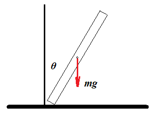

# Falling-Stick

## Summary

- Derived the Lagrangian of a falling stick.
- Numerically calculated the time it takes for the stick to fall down.
- Checked the numerical computation experimentally, and confirmed it.

## Future work
- Develope a web application where a user can enter the lenght of a stick, and get the time it will take it to fall down